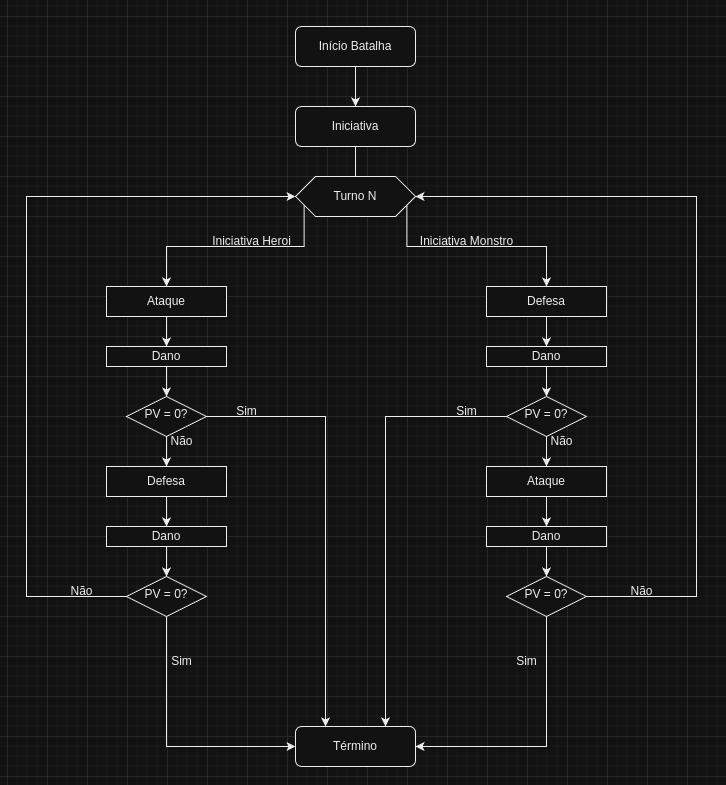

# API RPG-D&D
API para jogar e se divertir no fascinante mundo de Dungeons & Dragons.

## 📜 Sumário
1. [Detalhes do projeto](https://github.com/DanJusto/API-ControleEstoque#1--detalhes-do-projeto)
2. [Para rodar o projeto](https://github.com/DanJusto/API-ControleEstoque#3--para-rodar-o-projeto)
3. [Documentação](https://github.com/DanJusto/API-ControleEstoque#4--documenta%C3%A7%C3%A3o)
4. [Autor](https://github.com/DanJusto/API-ControleEstoque#5--autor)

## 1. 🔍 Detalhes do projeto
A API RPG-D&D tem como objetivo controlar o fluxo de um jogo de RPG e persistir dados. Foi realizado academicamente durante o Bootcamp Java Academy, iniciativa da Ada em parceria com a Avanade.

#### Cenário:
* O sistema permite o cadastro de usuário, com validação de informações;
* O sistema permite apenas as requisições de cadastro de usuário e login sem autenticação por meio de JWT;
* Com o usuário logado, o sistema permite a criação edição das informações do usuário, CRUD de personagem, iniciar uma batalha e se aventurar pelo fluxo do jogo;
* O sistema não permite acessar personagens e batalhas que não são do usuário logado.
* A quantidade de vitórias e derrotas ficam registrados em cada personagem, assim como o fluxo da batalha fica armazenado para posterior consulta do histórico da batalha;
* O sistema engessa o usuário para não permitir burlar as regras do jogo, seguindo, basicamente, o fluxo abaixo:



## 2. 🔌 Para rodar o projeto
1. Instale as dependências necessárias com o Maven para rodar a API (relacionadas no pom.xml). Caso queira utilizar linha de comando:

    ```
    mvn dependency:copy-dependencies
    ```
2. A API utiliza o PostgreSQL como banco de dados em um container Docker, então se faz necessário que você tenha o Docker instalado em sua máquina.

3. Com o Docker instalado, basta subir o container já configurado no `docker-compose` utilizando o comando abaixo:

    ```
    docker compose up
    ```

4. Rode a aplicação que o sistema já irá criar as tabelas automaticamente, deixando-as prontas para uso.
5. Por padrão, a aplicação rodará na porta 8080 e o banco de dados na porta 5433. Caso estejam ocupadas, se faz necessário alterá-las no `application.properties`:

    ```
    server.port=8080
    spring.datasource.url=jdbc:postgresql://localhost:5433/rpg_avanade
    ```

6. Você precisará de uma ferramenta de teste de requisições como o [Insomnia](https://insomnia.rest/) ou utilizar o [Swagger-Ui](http://localhost:8080/swagger-ui/index.html), devendo seguir as orientações da documentação abaixo para utilizar a API.

7. Você pode rodar os testes automatizados criados com JUnit.

## 3. 🔌 Documentação
### Endpoints

**Auth** <br/>
[`POST /login`](#post-login) - Autenticação de usuário (login)
<br/>

**User** <br/>
[`POST /user`](#post-user) - Criação de um novo usuário <br/>
[`PATCH /user`](#patch-user) - Alterar nome ou e-mail do usuário <br/>
[`PATCH /user/password`](#patch-user-password) - Alterar o password do usuário
<br/>

**Character** <br/>
[`POST /character`](#post-character) - Criação de um novo personagem <br/>
[`GET /character`](#get-character) - Listagem dos personagens do usuário logado <br/>
[`GET /character/:id`](#get-character-id) - Detalhamento um de personagem <br/>
[`PATCH /character/:id`](#patch-character-id) - Alterar o nome do personagem <br/>
[`DELETE /character/:id`](#delete-character-id) - Remoção de um personagem
<br/>

**Game** <br/>
[`POST /battle/:characterId/play`](#post-play) - Início de uma nova batalha <br/>
[`POST /battle/:characterId/attack/:battleId`](#post-attack) - Execução de um ataque <br/>
[`POST /battle/:characterId/defense/:battleId`](#post-defense) - Execução de uma defesa <br/>
[`POST /battle/:characterId/damage/:battleId`](#post-damage) - Apuração do dano <br/>
[`GET /battle/:characterId/historic/:battleId`](#get-historic) - Detalhamento de uma batalha e seus turnos

###
#### POST login

Logar com um usuário por meio de `username` e `password`. Retorna um token JWT para ser utilizado nas requisições.

**Request**

| **Nome** |**Obrigatório**|**Tipo**| **Descrição**       |
|:---------| :------------ | :------------ |:--------------------|
| username |sim|`string`| Username do usuário |
| password |sim|`string`| Senha do usuário    |

> **_NOTA:_**  Não é necessário enviar Token JWT via Authorization Header.

Exemplo de requisição:

```json
{
   "username": "fulano",
   "password": "password"
}
```

**Response**

Sucesso
```json
{
  "type": "Bearer",
  "token": "abcdefghijklmno.abcdefghijklmnopqrstuvwxyz.abcdefghijklmnop"
}
```
```status: 200```
<br /><br />
Erro comum

```json
{
    "message": "Authentication failed."
}
```
```status: 401```
<br/>

###
#### POST user

Criar um usuário para poder utilizar a API e jogar D&D.

**Request**

| **Nome** | **Obrigatório** | **Tipo** | **Descrição**       |
|:---------|:----------------|:---------|:--------------------|
| name     | sim             | `string` | Nome para perfil    |
| username | sim             | `string` | Username do usuário |
| email    | sim             | `string` | mail do usuário     |
| password | sim             | `string` | Senha do usuário    |

> **_NOTA:_**  Não é necessário enviar Token JWT via Authorization Header.

Exemplo de requisição:

```json
{
   "name": "Fulano",
   "username": "fulano",
   "email": "fulano@email.com",
   "password": "password"
}
```

**Response**

Sucesso
```json
{
   "id": 1,
   "name": "Fulano",
   "username": "fulano",
   "email": "fulano@email.com"
}
```
```status: 201```
<br /><br />
Erros comuns

```json
{
   "message": "Email already in use"
}
```
```status: 400```
```json
{
   "message": "Username already in use"
}
```
```status: 400```
```json
[
   {
      "field": "name",
      "message": "must not be blank"
   },
   {
      "field": "username",
      "message": "must not be blank"
   },
   {
      "field": "username",
      "message": "The password must have at least 6 characters"
   },
   {
      "field": "password",
      "message": "The password must have at least 8 characters"
   },
   {
      "field": "email",
      "message": "must be a well-formed email address"
   }
]
```
```status: 400```
<br/>

###
#### PATCH user

**Request**

Editar um usuário. Apenas nome e e-mail podem ser editados (ou apenas um dos dois).

| **Nome** | **Obrigatório** |**Tipo**| **Descrição**                          |
|:---------|:----------------| :------------ |:---------------------------------------|
| name     | não             |`string`| Nome do usuário                        |
| email    | não             |`string`| Email do usuário                       |
| password | sim             |`string`| Password do usuário (para confirmação) |

> **_NOTA:_**  É necessário enviar Token JWT via Authorization Header.

Exemplo de requisição:

```json
{
   "name": "Fulano Editado",
   "email": "fulano.editado@email.com",
   "password": "password"
}
```

**Response**

Sucesso
```json
{
   "id": 1,
   "name": "Fulano Editado",
   "username": "fulano",
   "email": "fulano.editado@email.com"
}
```
```status: 200```
<br/><br/>
Erros comuns

```json
{
   "message": "Email already in use"
}
```
```status: 400```
```json
{
   "message": "Password not match"
}
```
```status: 401```
```json
{
   "message": "User not found"
}
```
```status: 404```
```json
[
   {
      "field": "email",
      "message": "must be a well-formed email address"
   },
   {
      "field": "password",
      "message": "The password must have at least 8 characters"
   }
]
```
```status: 400```
<br/>

###
#### PATCH user-password

**Request**

Alterar o password do usuário.

| **Nome**      | **Obrigatório**|**Tipo**| **Descrição**      |
|:--------------|:---------------| :------------ |:-------------------|
| password      | sim            |`string`| Password do usuário |
| newPassword   | sim            |`string`| Novo password      |

> **_NOTA:_**  É necessário enviar Token JWT via Authorization Header.

Exemplo de requisição:

```json
{
   "password": "password",
   "newPassword": "novopassword"
}
```

**Response**

Sucesso
<br/>
```no body returned for response``` <br/>
```status: 204```

<br />
Erro comum

```json
{
   "message": "Password not match"
}
```
```status: 401```
```json
{
   "message": "User not found."
}
```
```status: 404```
```json
[
   {
      "field": "password",
      "message": "must not be blank"
   },
   {
      "field": "newPassword",
      "message": "The password must have at least 8 characters"
   }
]
```
```status: 400```

###
#### POST character

Cadastrar um personagem novo.</br>
**Atente-se que o `characterClass` é um Enum e aceita os seguintes tipos:** `WARRIOR`, `BARBARIAN`, `KNIGHT`, `ORC`, `GIANT`, `WEREWOLF`.

**Request**

| **Nome**       |**Obrigatório**|**Tipo**| **Descrição**               |
|:---------------| :------------ | :------------ |:----------------------------|
| name           |sim|`string`| Nome do personagem          |
| characterClass |sim|`string`| Classe do personagem (ENUM) |

> **_NOTA:_**  É necessário enviar Token JWT via Authorization Header.

Exemplo de requisição:

```json
{
   "name": "Willian Wallace",
   "characterClass": "KNIGHT"
}
```

**Response**

Sucesso
```json
{
   "id": 1,
   "name": "Willian Wallace",
   "characterClass": "KNIGHT",
   "victories": 0,
   "defeats": 0,
   "userId": 1
}
```
```status: 201```
<br/><br/>
Erros comuns

```json
{
    "message": "You already have a character with this name"
}
```
```status: 400```
```json
{
    "message": "User not found"
}
```
```status: 404```
```json
[
   {
      "field": "name",
      "message": "must not be blank"
   },
   {
      "field": "characterClass",
      "message": "must not be null"
   }
]
```
```status: 400```
<br/>

###
#### GET character

Listar personagens. **Utiliza paginação a partir de 10 personagens.**

**Request**

``` Não é necessário enviar dados na requisição ```

**Response**

Sucesso
```json
{
   "content": [
      {
         "id": 1,
         "name": "Willian Wallace",
         "characterClass": "KNIGHT"
      }
   ],
   "pageable": {
      (...)
   },
   (...)
}
```
```status: 200```

Sucesso sem retorno de dados

```json
{
   "content": [],
   "pageable": {
      (...)
   },
   (...)
}
```
```status: 200```

Erro comum

```json
{
    "message": "User not found"
}
```
```status: 404```

###
#### GET character-id

Detalhar um personagem. O `id` deve ser enviado na url.

**Request**

|**Nome**|**Obrigatório**|**Tipo**| **Descrição**                    |
| :------------ | :------------ | :------------ |:---------------------------------|
|id|sim|`number`| **Enviar via parâmetro de rota** |

> **_NOTA:_**  É necessário enviar Token JWT via Authorization Header.

**Response**

Sucesso
```json
{
   "id": 1,
   "name": "Willian Wallace",
   "characterClass": "KNIGHT",
   "victories": 0,
   "defeats": 0,
   "userId": 1
}
```
```status: 200```

Erros comuns

```json
{
    "message": "Character not found"
}
```
```status: 404```
```json
{
    "message": "User not found"
}
```
```status: 404```

<br/>

###
#### PATCH character-id

Alterar o nome do personagem. O `id` deve ser enviado na url.

**Request**

| **Nome** | **Obrigatório** |**Tipo**| **Descrição**                          |
|:---------|:----------------| :------------ |:---------------------------------------|
| id       | sim             |`number`| **Enviar via parâmetro de rota**       |
| name     | sim              |`string`| Novo nome para o personagem |

> **_NOTA:_**  É necessário enviar Token JWT via Authorization Header.

Exemplo de requisição:

```json
{
   "name": "Aquiles"
}
```

**Response**

Sucesso
```json
{
   "id": 1,
   "name": "Aquiles",
   "characterClass": "KNIGHT",
   "victories": 0,
   "defeats": 0,
   "userId": 1
}
```
```status: 200```
<br/><br/>

Erros comuns

```json
{
   "message": "You already have a character with this name"
}
```
```status: 400```
```json
{
    "message": "Character not found"
}
```
```status: 404```
```json
{
    "message": "User not found"
}
```
```status: 404```
```json
[
   {
      "field": "name",
      "message": "must not be blank"
   }
]
```
```status: 400```

###
#### DELETE character-id

Deletar um personagem. O `id` deve ser enviado na url.

**Request**

|**Nome**|**Obrigatório**|**Tipo**|**Descrição**|
| :------------ | :------------ | :------------ | :------------ |
|id|sim|`number`|**Enviar via parâmetro de rota**|

> **_NOTA:_**  É necessário enviar Token JWT via Authorization Header.

**Response**

Sucesso  
```no body returned for response``` <br/>
```status: 204```
<br/>

Erros comuns

```json
{
    "message": "Character not found"
}
```
```status: 404```
```json
{
    "message": "User not found"
}
```
```status: 404```

###
#### POST play

Iniciar uma batalha. O `characterId` deve ser enviado na url. </br>
Exemplo: `.../battle/{characterId}/play` </br>
Note-se que apenas um personagem que pertence ao dono do Token será aceito.

**Request**

| **Nome**   |**Obrigatório**| **Tipo** | **Descrição**     |
|:-----------| :------------ |:---------|:------------------|
| characterId     |sim| `number` | **Enviar via parâmetro de rota**  |

> **_NOTA:_**  É necessário enviar Token JWT de *Admin* via Authorization Header.

**Response**

Sucesso
```json
{
   "id": 1,
   "monster": "WEREWOLF",
   "initiative": "MONSTER",
   "character": {
      "id": 1,
      "name": "Aquiles",
      "characterClass": "KNIGHT",
      "victories": 0,
      "defeats": 0,
      "userId": 1
   }
}
```
```status: 200```

Erros comuns

```json
{
   "message": "Character not found"
}
```
```status: 404```
```json
{
   "message": "User not found"
}
```
```status: 404```

###
#### POST attack

Executar um ataque. O `characterId` e o `battleId` devem ser enviados na url. </br>
Exemplo: `.../battle/{characterId}/attack/{battleId}` </br>
Note-se que para realizar o ataque é necessário entender o fluxo do jogo e verificar a iniciativa da batalha. Caso a iniciativa seja do herói, ele poderá realizar o ataque logo após o início da batalha e a cada término de turno. Caso a iniciativa seja do monstro, o herói precisa se defender primeiro (próximo endpoint) antes de realizar um ataque.

**Request**

| **Nome**   |**Obrigatório**| **Tipo** | **Descrição**                    |
|:-----------| :------------ |:---------|:---------------------------------|
| characterId     |sim| `number` | **Enviar via parâmetro de rota** |
| battleId |sim| `number` | **Enviar via parâmetro de rota** |

> **_NOTA:_**  É necessário enviar Token JWT via Authorization Header.

**Response**

Sucesso
```json
{
   "shiftId": 1,
   "hit": false,
   "diceAtkHero": 3,
   "diceDefMonster": 9
}
```
```status: 200```
<br/><br/>
Erros comuns

```json
{
   "message": "Hero lost in initiative and must defend first"
}
```
```status: 400```
```json
{
   "message": "Hero already attacked this round"
}
```
```status: 400```
```json
{
   "message": "This battle already ended"
}
```
```status: 400```
```json
{
   "message": "Battle not found."
}
```
```status: 404```
<br/>

###
#### POST defense

Executar uma defesa. O `characterId` e o `battleId` devem ser enviados na url. </br>
Exemplo: `.../battle/{characterId}/defense/{battleId}` </br>
Note-se que para realizar a defesa é necessário entender o fluxo do jogo e verificar a iniciativa da batalha. Caso a iniciativa seja do herói, ele deverá defender apenas após ter realizado o seu ataque, encerrando o turno após sua defesa. Caso a iniciativa seja do monstro, o herói deverá se defender logo após o início da batalha e a cada início de turno.

**Request**

| **Nome**       |**Obrigatório**| **Tipo** | **Descrição**                    |
|:---------------| :------------ |:---------|:---------------------------------|
| characterId    |sim| `number` | **Enviar via parâmetro de rota** |
| battleId       |sim| `number` | **Enviar via parâmetro de rota** |

> **_NOTA:_**  É necessário enviar Token JWT via Authorization Header.

**Response**

Sucesso
```json
{
   "shiftId": 1,
   "hit": true,
   "diceDefHero": 5,
   "diceAtkMonster": 12
}
```
```status: 200```
<br/><br/>
Erros comuns

```json
{
   "message": "Hero win in initiative and must attack first"
}
```
```status: 400```
```json
{
   "message": "Hero already defended this round"
}
```
```status: 400```
```json
{
   "message": "This battle already ended"
}
```
```status: 400```
```json
{
   "message": "Battle not found."
}
```
```status: 404```
<br/>

###
#### POST damage

Calcular o dano. O `characterId` e o `battleId` devem ser enviados na url. </br>
Exemplo: `.../battle/{characterId}/damage/{battleId}` </br>
Note-se que o cálculo do dano deve ser acionado sempre após uma ação (ataque ou defesa).
Mesmo que o herói ou o monstro tenha errado o ataque, o endpoint do dano deve ser acionado, pois é este endpoint que verifica o encerramento do turno, seguindo o fluxo desenhado anteriormente.

**Request**

| **Nome**    |**Obrigatório**| **Tipo** | **Descrição**                    |
|:------------| :------------ |:---------|:---------------------------------|
| characterId |sim| `number` | **Enviar via parâmetro de rota** |
| battleId    |sim| `number` | **Enviar via parâmetro de rota** |
| shiftId     |sim| `number` | Enviar no body                   |

> **_NOTA:_**  É necessário enviar Token JWT via Authorization Header.

Exemplo de requisição:

```json
{
   "shiftId": 1
}
```

**Response**

Sucesso
```json
{
   "shiftId": 1,
   "damage": 7,
   "pv": 25
}
```
```status: 200```
<br/><br/>
Erros comuns

```json
{
   "message": "Character missed attack"
}
```
```status: 400```
```json
{
   "message": "Monster missed attack"
}
```
```status: 400```
```json
{
   "message": "Damage already registered"
}
```
```status: 400```
```json
{
   "message": "Shift has ended"
}
```
```status: 400```
```json
{
   "message": "This battle already ended"
}
```
```status: 400```
```json
{
   "message": "Battle not found"
}
```
```status: 404```
<br/>

###
#### GET historic

Buscar histórico de uma batalha. O `characterId` e o `battleId` devem ser enviados na url. </br>
Exemplo: `.../battle/{characterId}/historic/{battleId}` </br>

**Request**

|**Nome**|**Obrigatório**|**Tipo**|**Descrição**|
| :------------ | :------------ | :------------ | :------------ |
| characterId |sim| `number` | **Enviar via parâmetro de rota** |
| battleId    |sim| `number` | **Enviar via parâmetro de rota** |

> **_NOTA:_**  É necessário enviar Token JWT via Authorization Header.

**Response**

Sucesso
```json
{
   "battleId": 1,
   "characterClass": "KNIGHT",
   "characterName": "Aquiles",
   "monsterClass": "WEREWOLF",
   "initiative": "HERO",
   "shifts": [
      {
         "round": 1,
         "diceAtkCharacter": 10,
         "diceDefMonster": 3,
         "diceAtkMonster": 5,
         "diceDefCharacter": 11,
         "characterHit": true,
         "monsterHit": false,
         "diceDamageCharacter": 10,
         "diceDamageMonster": 0,
         "hpCharacter": 26,
         "hpMonster": 24
      },
      {
         "round": 2,
         "diceAtkCharacter": 12,
         "diceDefMonster": 5,
         "diceAtkMonster": 8,
         "diceDefCharacter": 3,
         "characterHit": true,
         "monsterHit": true,
         "diceDamageCharacter": 12,
         "diceDamageMonster": 5,
         "hpCharacter": 21,
         "hpMonster": 12
      },
      {
         "round": 3,
         "diceAtkCharacter": 9,
         "diceDefMonster": 1,
         "diceAtkMonster": 8,
         "diceDefCharacter": 4,
         "characterHit": true,
         "monsterHit": true,
         "diceDamageCharacter": 12,
         "diceDamageMonster": 8,
         "hpCharacter": 13,
         "hpMonster": 0
      }
   ]
}
```
```status: 200```

Erro comum

```json
{
   "message": "Battle not found"
}
```
```status: 404```


## 4. 👨‍💻 Autor
Criado por Daniel Justo

[](https://www.linkedin.com/in/danielmjusto/)
[](https://github.com/DanJusto)

Obrigado pela visita!